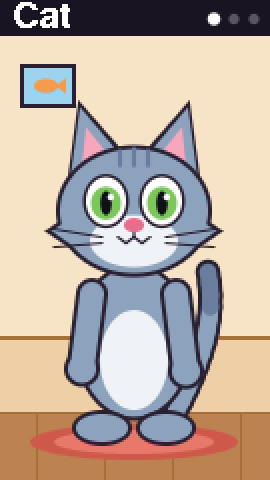
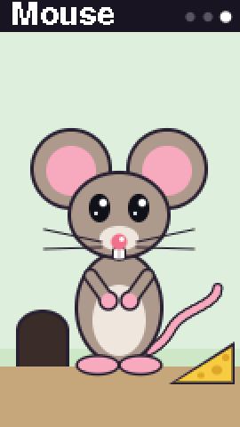

# M5TalkingTom

A Talking Tom–style toy for the [M5StickS3](https://docs.m5stack.com/en/core/StickS3):
say something, and a cartoon character repeats it in a funny voice, moving
its mouth and paws.

| Cat | Hippo | Mouse |
|---|---|---|
|  |  |  |
| a cartoon voice, like Talking Tom | a deep bass | a squeaky voice |

## How to play

- Switch it on with the side button: the Cat is listening.
- Say a phrase. The character tilts its head and cups its ear while you
  speak, and repeats the phrase as soon as you stop.
- The blue button (KEY1, under the screen) switches to the next character:
  Cat → Hippo → Mouse → Cat. The new one drops in from above.
- After two minutes without a phrase the character gets sleepy, waves
  goodbye and the toy powers off. A press of the blue button while it waves
  keeps it on.

## How the voices work

The phrase is recorded at 16 kHz, then its pitch is shifted while the tempo
stays about the same (a WSOLA time stretch followed by resampling), so the
formants move with the pitch and the voice sounds like a cartoon rather than
a sped-up tape:

| Character | Pitch | Tempo | Extra |
|---|---|---|---|
| Cat | ×1.6 | ×1.05 | light vibrato |
| Hippo | ×0.62 | ×0.9 | soft clipping for a gritty bass |
| Mouse | ×2.2 | ×1.2 | vibrato |

A limiter makes the result as loud as the tiny speaker allows.

## Building

With [PlatformIO](https://platformio.org/):

```bash
pio test -e native            # unit tests of the logic, on the computer
pio run -e sticks3 -t upload  # build and flash
pio run -e sticks3 -t merged  # single image for M5Burner (flash at 0x0)
```

`CLAUDE.md` has the details: architecture, the automatic end-to-end test
(the computer speaks test phrases, the board answers, a script checks the
pitch and timing), board quirks and measurements. The characters are
designed in `tools/character_prototype.html`, which opens in any browser.
